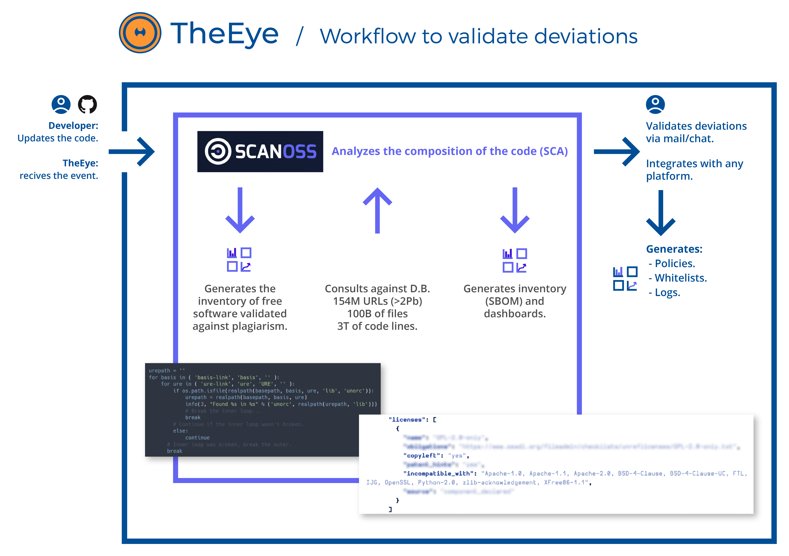
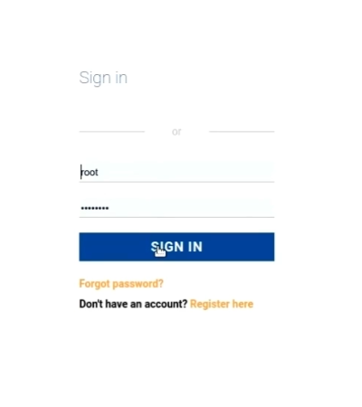
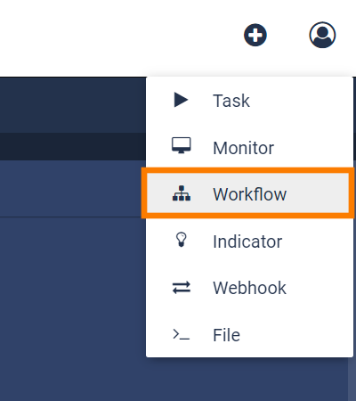
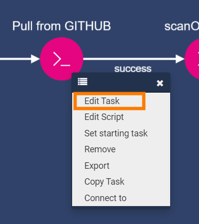
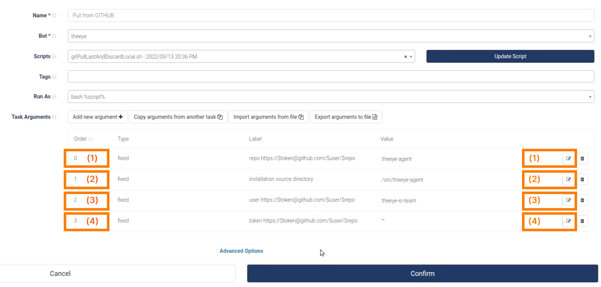
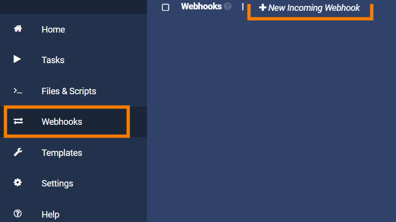
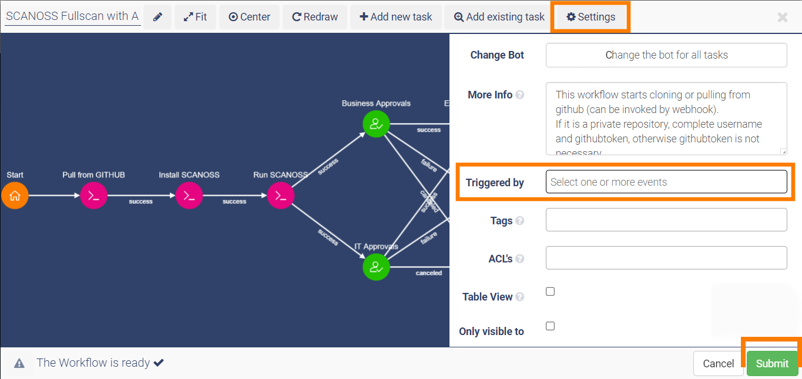

 # How to integrate SCANOSS to your Continuous Integration Pipeline from github by using TheEye as the choreographer on a single machine.



If you want, check this 2 mins video:

[](https://youtu.be/GxjtUZ6cnKI)

## Quickly install TheEye in your local environment.

This tutorial was written using Ubuntu 22.04. For achieving this task you need to clone our repository and run quickstart.sh

Please run:
```bash
git clone https://github.com/theeye-io-team/theeye-of-sauron.git

./quickstart.sh
```

For more information, please refer to our [Documentation](https://documentation.theeye.io/#/)

## Import and configure your workflow.

1. Once it is finished, please login at http://localhost:6080 and complete it with the credentials provided by the installer

    > **Warning**
    > The login credentials should be changed ASAP if you're planning on exposing TheEye to the internet

    

2. Download the file [`SCANOSSWorkflow.json`](./SCANOSSWorkflow.json) provided in this repo and import it into Theeye
   1. Click on the **+** menu and select *Workflow*
   2. Choose *Import* and select the file `SCANOSSWorkflow.json` 
   
    |||
    |----|----|

3. Set your Github repository. 
   1.  Edit the task called *'Pull from GITHUB'*. You can edit the task by clicking on it and clicking 'Edit task' in the context menu
   2.  Scroll down to *Task Arguments* and edit them as needed:
       1.  The name of the repo
       2.  The installation source directory
       3.  The GitHub username of whom the repo belongs to
       4.  The GitHub user's access token, optional if the repo is public

    > **Note**
    > This workflow works with private and public repositories, but for this tutorial we are working on a public repository.

    |||
    |----|----|

    <!-- TODO: Cambiar imagen 6, no es muy clara -->

4. Now set the deployment approvers and the users who will receive the notification.
   You should also configure a Webhook to continue the deployment pipeline, however in this tutorial we will skip this step.

    

## After setup

Once set up, we encourage you to manually execute the workflow to see what happens.
    
* Within the *Workflows* tab inside the dashboard, press the :arrow_forward: icon in the workflow to execute it

    

* We can see that it finds a deviation and asks for its approval, and we are done!

    > **Note**
    > This alert will be shown to the approvers set up on step 4 of the configuration guide

    

## Integrate the workflow into the pipeline

We can setup the workflow to start with an incoming webhook that we can configure from github
  
1. Navigate to the *Webhook* tab in TheEye
    
2. Create a new webhook and take a note of it's link
    
<!-- TODO: Mostrar cómo agarrar el link -->
<!-- Se puede remplazar la foto 11 que es bastante redundante -->
3. Edit the workflow, click on settings and choose your new webhook in the *Triggered by* input
    

And that's it! If you have any questions write to support@theeye.io or create a ticket in this repository

Please leave us a star at https://github.com/theeye-io-team/theeye-of-sauron.git

Thanks!


